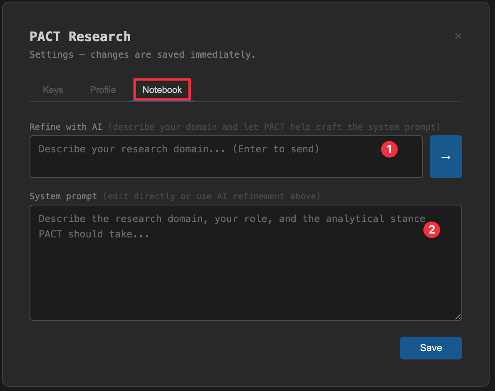
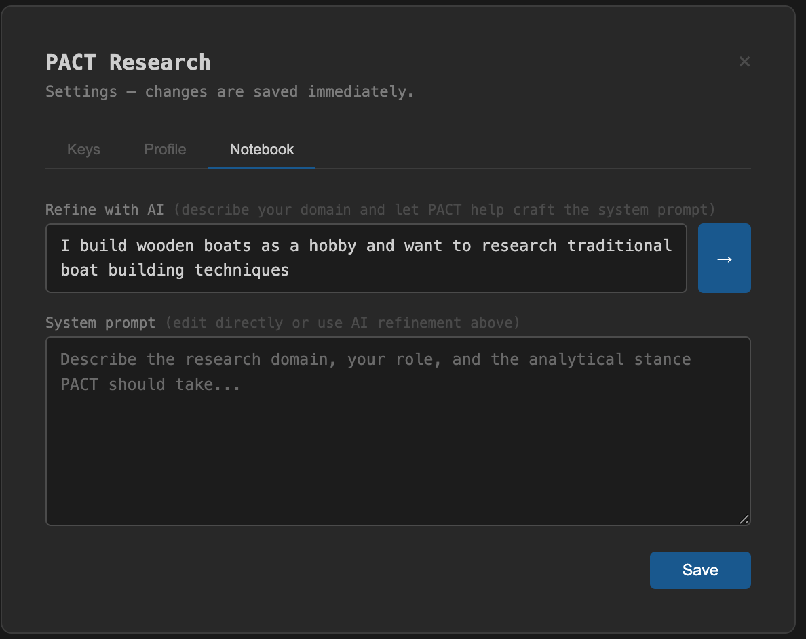
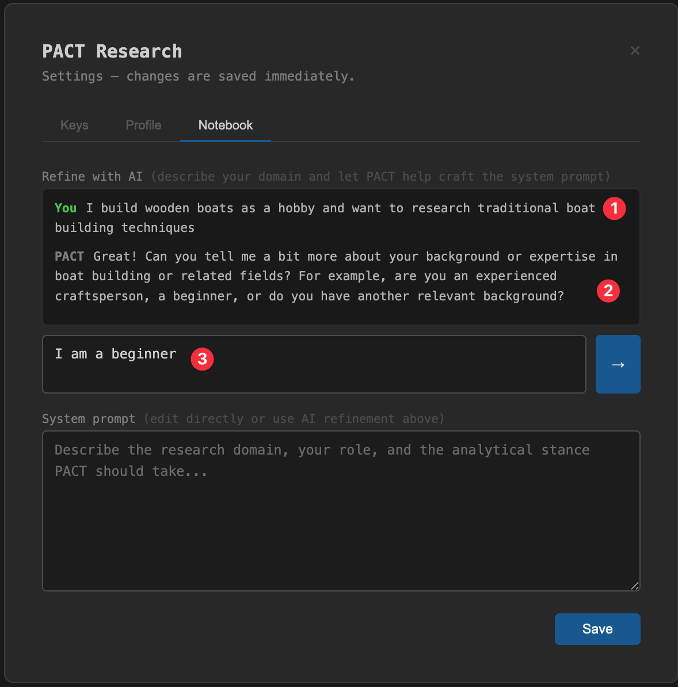
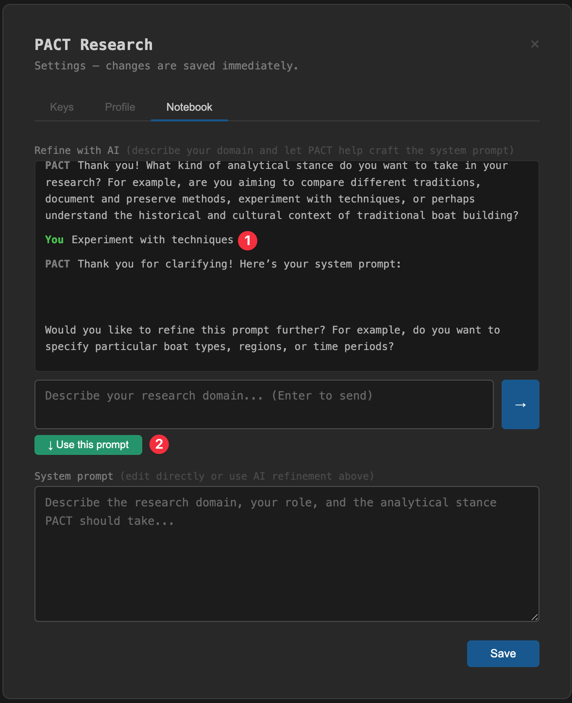
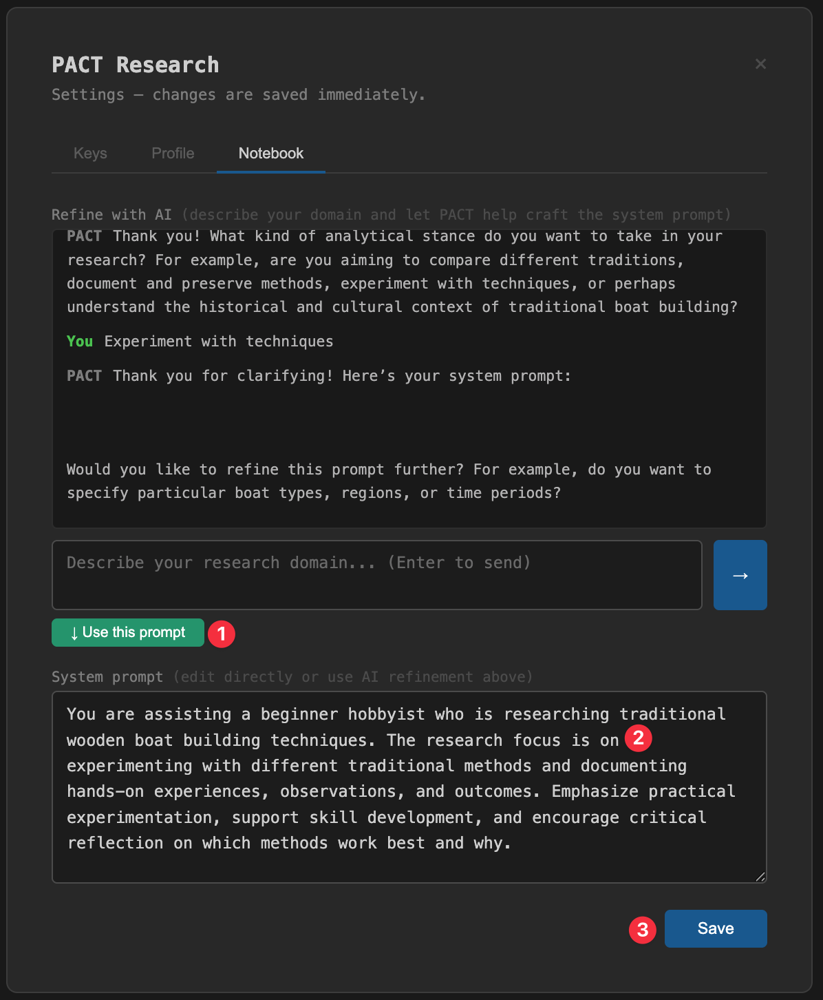
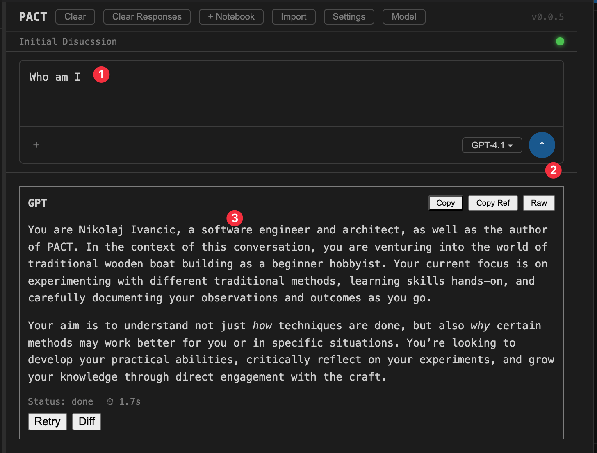

# Introducing IPR: Let PACT Help You Write Your System Prompt
*May 28, 2026 · Nikolaj Ivancic*
tag: Feature
excerpt: PACT now includes Iterative Prompt Refinement — a built-in AI conversation that helps any researcher craft a precise system prompt through a few simple questions.

---

A system prompt is the foundation of every PACT research notebook. It tells the AI your role, your domain, and the analytical stance you want it to take. Every discussion in the notebook inherits it silently — you never have to repeat yourself.

The problem: writing a good system prompt requires experience. A physician knows their specialty. A boat builder knows their craft. But neither necessarily knows how to translate that expertise into a precise AI instruction set.

IPR — Iterative Prompt Refinement — solves this.

## How it works

Open Settings from the PACT toolbar and click the Notebook tab. At the top you will see a new section: **Refine with AI**.

Type a brief description of what you want to research. It does not need to be precise — just enough to get started.

PACT will ask you one clarifying question at a time. It needs to know three things before it will generate a system prompt: your research domain, your role or expertise, and the analytical stance you want to take.

Answer each question naturally. After two or three exchanges, PACT generates a draft system prompt and asks if you want to refine it further.

Click **↓ Use this prompt**. The system prompt appears in the field below, ready to review and edit.

Click **Save**. The system prompt is stored in the notebook. Every subsequent discussion will run with it as context — silently, automatically.

## The result

Here is what a first research prompt looks like after IPR has established the wooden boat builder context:

The AI knows who you are, what you are researching, and how you want it to think. You got there in three questions.

## Why this matters

Every PACT notebook starts with a system prompt. Without IPR, that means either copying a pre-built prompt from a file, or writing one from scratch — neither of which is accessible to a researcher who is not already familiar with prompt engineering.

With IPR, the process is conversational. You describe your domain in plain language. PACT asks what it needs to know. The system prompt writes itself.

The IPR conversation is persistent. Close Settings and reopen it — the conversation is still there. Return to it later to refine the prompt further as your research evolves.

## Using IPR on the pactresearch.net service

When you request a research notebook through pactresearch.net, the IPR conversation is how we establish your domain context before building your notebook. You describe your research need, we refine it with you, and the resulting system prompt anchors everything that follows.

---

> Chat disappears. Research shouldn't.

Questions or thoughts? Email nikolaj.ivancic@gmail.com
